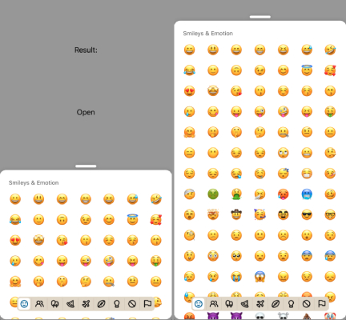

:::info
To preview app with this example, clone [**github repo**](https://github.com/TheWidlarzGroup/rn-emoji-keyboard.git) and run `yarn example ios` or `yarn example android`.
:::

### Usage

Basic usage of the emoji picker is very simple. Just import `EmojiPicker`, pass [**required props**](https://github.com/TheWidlarzGroup/rn-emoji-keyboard/docs/api/modal) and its ready to go.

```jsx
import EmojiPicker from 'rn-emoji-keyboard'

const ExampleComponent = () => {
  // ...

  return (
    <EmojiPicker open={isOpen} onClose={handleOnClose} onEmojiSelected={handleOnEmojiSelected} />
  )
}
```


