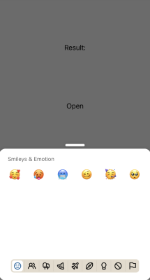

:::info
To preview app with this example, clone [**github repo**](https://github.com/TheWidlarzGroup/rn-emoji-keyboard.git) and run `yarn example ios` or `yarn example android`.
:::

### Usage

It's possible to pass your own set of emojis. You have to keep in mind that types and category titles must match the ones that we are using. In the example you can see custom emojis set that contains only emojis with unicode version === 11.

```jsx
import EmojiPicker, { emojisByGroup } from 'rn-emoji-keyboard'

import type { EmojisByCategory } from 'src/types'

const getCustomEmojis = () => {
  const newEmojiSet: EmojisByCategory[] = []
  for (const [, value] of Object.entries(emojisByGroup)) {
    const newData = value.data.filter((emoji) => parseFloat(emoji.v) === 11)
    newEmojiSet.push({
      title: value.title,
      data: newData,
    })
  }
  return newEmojiSet
}

const ExampleComponent = () => {
  // ...

  return (
    <EmojiPicker
      open={isOpen}
      onClose={handleOnClose}
      onEmojiSelected={handleOnEmojiSelected}
      customEmojisByGroup={getCustomEmojis()}
    />
  )
}
```


