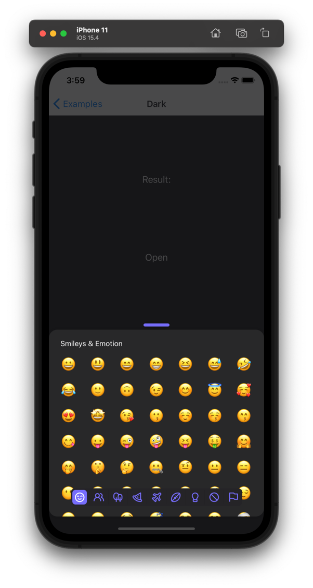

We do not provide a prop that will directly enable dark mode, but with the ability to adjust theme, you can easily achieve it
using theme prop.

```jsx
<EmojiPicker
  onEmojiSelected={handlePick}
  open={isModalOpen}
  onClose={() => setIsModalOpen(false)}
  theme={{
    backdrop: '#16161888',
    knob: '#766dfc',
    container: '#282829',
    header: '#fff',
    skinTonesContainer: '#252427',
    category: {
      icon: '#766dfc',
      iconActive: '#fff',
      container: '#252427',
      containerActive: '#766dfc',
    },
  }}
/>
```

The effect of the above code.


Above, the `theme` property is displayed with the styles required for the basic version of the EmojiPicker. Below, you'll find the `theme` property showcasing all available styles.

```jsx
<EmojiPicker
  onEmojiSelected={handlePick}
  open={isModalOpen}
  onClose={() => setIsModalOpen(false)}
  theme={{
    backdrop: '#16161888',
    knob: '#766dfc',
    container: '#282829',
    header: '#fff',
    skinTonesContainer: '#252427',
    category: {
      icon: '#766dfc',
      iconActive: '#fff',
      container: '#252427',
      containerActive: '#766dfc',
    },
    customButton: {
      icon: '#766dfc',
      iconPressed: '#fff',
      background: '#252427',
      backgroundPressed: '#766dfc',
    },
    search: {
      text: '#fff',
      placeholder: '#ffffff2c',
      icon: '#fff',
      background: '#00000011',
    },
  }}
/>
```
