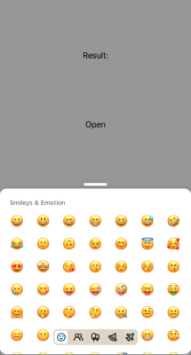

:::info
To play with examples you can clone [**the repo**](https://github.com/TheWidlarzGroup/rn-emoji-keyboard.git) and run `yarn example ios` or `yarn example android` to preview app with this examples.
:::

It is a long established fact that a reader will be distracted by the readable content of a page when looking at its layout.

```jsx
import EmojiPicker from 'rn-emoji-keyboard'

const ExampleComponent = () => {
  // ...

  return (
    <EmojiPicker
      open={isOpen}
      onClose={handleOnClose}
      onEmojiSelected={handleOnEmojiSelected}
      //  add props below
      disabledCategories={['activities', 'flags', 'objects', 'symbols']}
    />
  )
}
```


