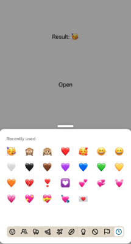

:::info
To preview app with this example, clone [**github repo**](https://github.com/TheWidlarzGroup/rn-emoji-keyboard.git) and run `yarn example ios` or `yarn example android`.
:::

### Usage

To add an extra category with last used emojis, you need to pass `enableRecentlyUsed` props to `EmojiPicker`.

```jsx
import EmojiPicker from 'rn-emoji-keyboard'

const ExampleComponent = () => {
  // ...

  return (
    <EmojiPicker
      open={isOpen}
      onClose={handleOnClose}
      onEmojiSelected={handleOnEmojiSelected}
      //  add props below
      enableRecentlyUsed
    />
  )
}
```


