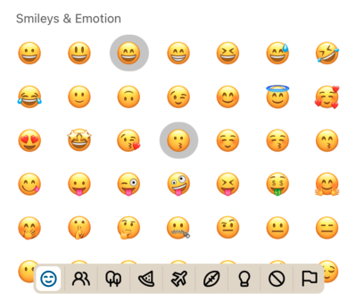

:::info
To preview app with this example, clone [**github repo**](https://github.com/TheWidlarzGroup/rn-emoji-keyboard.git) and run `yarn example ios` or `yarn example android`.
:::

### Usage

To use this feature you have to pass a currentlySelectedEmoji array with emojis names.  
By default currently selected emojis don't have any extra styles. This customizable with the selectedEmojiStyle prop.
We have disabled styles that change the width or height of the emoji to prevent layout breaks.  
You are also able to pass selectedEmojiCallback prop which will be invoked when currently selected emoji is pressed.

```jsx
import EmojiPicker from 'rn-emoji-keyboard'

const ExampleComponent = () => {
  // ...
  const [currentlySelectedEmojis, seCurrentlySelectedEmojis] = useState([])

  const handleOnEmojiSelected = (emoji: EmojiType) => {
    //..Your on select logic

    // Add pressed emoji to the currently selected array
    setCurrentlySelectedEmojis((prev) => [...prev, emoji.name])
  }

  const handleAlreadySelectedEmojiPress = (emoji: emojiType) => {
    // Remove pressed emoji from the currently selected array
    setCurrentlySelectedEmojis((prev) => prev.filter((emojiName) => emojiName !== emoji.name))
  }

  return (
    <EmojiPicker
      open={isOpen}
      onClose={handleOnClose}
      onEmojiSelected={handleOnEmojiSelected}
      currentlySelectedEmojis={currentlySelected}
      selectedEmojiStyle={{
        borderRadius: 25,
        backgroundColor: '#cccccc',
      }}
    />
  )
}
```


