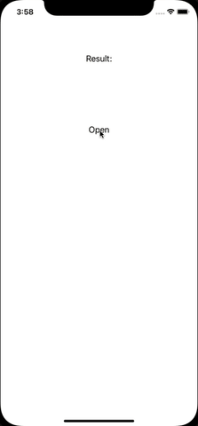

# About

:::note
This is a documentation website of the current stable release.
:::

RN Emoji Keyboard aims to provide Emoji picker feature that is missing in native keyboards.

## Motivation

At the beginning we wanted to allow user to select any emoji for post reactions in our example app [Holidaily] but unfortunately, there isn't native feature to call out keyboard with option to select only emoji (or even default switched to emoji) neither any library with this feature (or more precisely - any good enough for us). Thus, the motivation for building this library was to allow user picking any emoji without allowing to type anything from keyboard. If you want to build features like emoji picker in chat app or Messenger like emoji reaction, this library is perfect for you.

## Library Overview

The library gives you the possibility to choose from two modes: modal or static.
To find out more about the static mode, see [here](/docs/api/static)).
To find out more about the modal mode, see [here](/docs/api/modal).

The library supports skintone modifiers by default from 1.0.0 version. After a long press on certain emojis, panel with multiple options appears.

We put a lot of effort into optimising and improving performance of this library.
The library's current score (based on RN-Perf Monitor plugin for Flipper): 90

### Learning resources

**Apps**

[Example app](https://github.com/TheWidlarzGroup/rn-emoji-keyboard/tree/master/example) - react-native application with features overview and test cases.

[Holidaily](https://github.com/TheWidlarzGroup/holidaily) - our company's example project that uses RN Emoji Keyboard.

**Talks**

[Showcase of rn-emoji-keyboard library. Enhance your communication with the language of emoji](https://www.react-native.eu/) - talk about the library at the React Native EU 2022 conference
